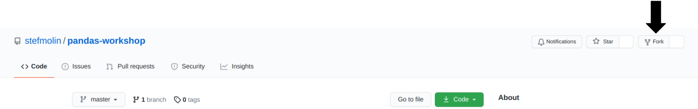
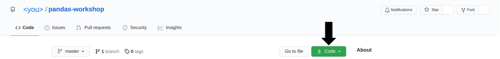

# The Data Foundations Labs 

Welcome to the first lab of the Data Foundations course. As you can see the lab instructions are in English. 

As python is increasingly becoming the standard programming language for data applications we will also use python during the labs. Prior knowledge of python can help you during the labs but is not required. We will start with a python crash course to get you up to speed. We will use python interactively with jupyter notebooks. These are a great and intuitive tool to experiment and develop python code. 

We will use Github Classroom to distribute the labs. This will also be used to evaluate your work. Make sure to push your work to the repo before the deadline!

To make sure that everyone works in the same environment this lab will be done on a VM in the Azure Cloud. With the [Azure for Students](https://azure.microsoft.com/en-us/free/students/) program you receive $100 Azure credit plus several free services which should be more than sufficient for the course labs. Assuming you stop the VM after working on the lab and you do not spend your credit on other purposes.

Below you can find step-by-step instructions on how to set-up the VM.

# Lab 1: Pandas

Working with data can be challenging: it often doesn’t come in the best format for analysis, and understanding it well enough to extract insights requires both time and the skills to filter, aggregate, reshape, and visualize it. This session will equip you with the knowledge you need to effectively use pandas – a powerful library for data analysis in Python – to make this process easier.

Pandas makes it possible to work with tabular data and perform all parts of the analysis from collection and manipulation through aggregation and visualization. While most of this session focuses on pandas, during our discussion of visualization, we will also introduce at a high level Matplotlib (the library that pandas uses for its visualization features, which when used directly makes it possible to create custom layouts, add annotations, etc.) and Seaborn (another plotting library, which features additional plot types and the ability to visualize long-format data).

## Outline

The labs are divided into the following sections:

### Section 0: Python 101
We start with a crash course on python. A more in depth tutorial can be found [here](https://docs.python.org/3/tutorial/)

### Section 1: Getting Started With Pandas
We will begin by introducing the `Series`, `DataFrame`, and `Index` classes, which are the basic building blocks of the pandas library, and showing how to work with them. By the end of this section, you will be able to create DataFrames and perform operations on them to inspect and filter the data.

### Section 2: Data Wrangling
To prepare our data for analysis, we need to perform data wrangling. In this section, we will learn how to clean and reformat data (e.g., renaming columns and fixing data type mismatches), restructure/reshape it, and enrich it (e.g., discretizing columns, calculating aggregations, and combining data sources).

### Section 3: Data Visualization
The human brain excels at finding patterns in visual representations of the data; so in this section, we will learn how to visualize data using pandas along with the Matplotlib and Seaborn libraries for additional features. We will create a variety of visualizations that will help us better understand our data.

### Section 4: Hands-On Data Analysis Lab
We will practice all that you’ve learned in a hands-on lab. This section features a set of analysis tasks that provide opportunities to apply the material from the previous sections.

---

## Setup Instructions

### Azure for students account
Sign up for your free [Azure for students](https://azure.microsoft.com/en-us/free/students/) account by registering with your school email. You will receive $100 credits)

### VS Code
Download and install [Visual Studio Code](https://code.visualstudio.com/) on your local machine.

### Creating Azure Virtual machine
1. Go to the [Azure portal](https://portal.azure.com/) and click on `+ Create a resource`, find the `Virtual machine` service and click on `Create`. 

                      

2. Insert the basic information for your VM:
    - Make sure the subscription is `Azure for Students`
    - Make a new Resource group (for example `Data-Foundations`)
    - Choose a name for the VM (for example 'DF-lab')
    - Set the region to West-Europe
    - Make sure you choose this image: `Ubuntu 18.04 LTS with Python and Docker`
    - Set the size of the VM to `Standard_B2s`
    - Choose SSH for the Authentication type
    
    

3. Go to the `Networking` tab and click `create new` for public IP. Make sure to choose `Basic` SKU and `Dynamic` Assignment.

    

4. Under the `Management` tab tick the `Enable auto-shutdown` to avoid large bills
    
    

5. Go the the `Review + create` tab and click `create`.

6. Download your private key and save it in the `~./ssh` folder.

### Keeping costs at a minimum

- Always stop your VM when you are ready by going to the VM resource and clicking the stop button.
    
    
    
- Keep a regular eye on your costs in the `Cost analysis` service under the `Cost management`. 

    

### Using VS Code to connect to your VM with SSH

1. Open VS Code.


### Cloning the repo to your VM

### Installing miniconda and create a cirtual environment

### Launch Jupyterlab


2. Fork this repository:

    

2. Clone your forked repository:

    

3. Create and activate a Python virtual environment:
    - If you installed Anaconda/Miniconda, use `conda` (on Windows, these commands should be run in **Anaconda Prompt**):

        ```shell
        $ cd pandas-workshop
        ~/pandas-workshop$ conda env create --file environment.yml
        ~/pandas-workshop$ conda activate pandas_workshop
        (pandas_workshop) ~/pandas-workshop$
        ```

    - Otherwise, use `venv`:

        ```shell
        $ cd pandas-workshop
        ~/pandas-workshop$ python3 -m venv pandas_workshop
        ~/pandas-workshop$ source pandas_workshop/bin/activate
        (pandas_workshop) ~/pandas-workshop$ pip3 install -r requirements.txt
        ```

4. Launch JupyterLab:

    ```shell
    (pandas_workshop) ~/pandas-workshop$ jupyter lab
    ```

---

## Reference
This material was adopted from an [introductory workshop on Pandas](https://github.com/stefmolin/pandas-workshop) by Stefanie Molin ([@stefmolin](https://github.com/stefmolin)).

